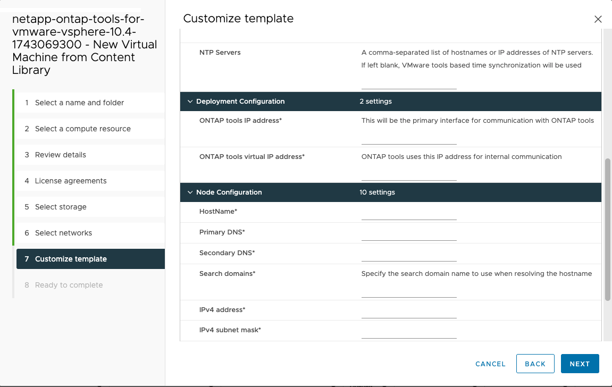

= Implantar ONTAP tools for VMware vSphere
:allow-uri-read: 
:icons: font
:imagesdir: ../media/

[role="lead"]
O dispositivo ONTAP tools for VMware vSphere é implantado como um nó único de pequeno porte com serviços principais para oferecer suporte a datastores NFS e VMFS. O processo de implantação do ONTAP Tools pode levar até 45 minutos.

.Antes de começar
Uma biblioteca de conteúdo no VMware é um objeto de contêiner que armazena modelos de VM, modelos de vApp e outros tipos de arquivos. A implantação com biblioteca de conteúdo proporciona uma experiência fluida, pois não depende da conectividade de rede.

NOTE: Você deve armazenar a biblioteca de conteúdo em um armazenamento de dados compartilhado para que todos os hosts dentro de um cluster possam acessá-la.  Crie uma biblioteca de conteúdo para armazenar o OVA antes de configurar o dispositivo para a configuração HA.  Não exclua o modelo de biblioteca de conteúdo após a implantação.

NOTE: Para habilitar a implantação de HA posteriormente, não implante a máquina virtual que hospeda as ferramentas ONTAP diretamente em um host ESXi.  Em vez disso, implante-o em um cluster ou pool de recursos.

Se você não tiver uma biblioteca de conteúdo, siga estas etapas para criar uma:

*Criar biblioteca de conteúdo* Se você planeja usar apenas uma pequena implantação de nó único, não é necessário criar uma biblioteca de conteúdo.

. Baixe o arquivo que contém os binários (_.ova_) e os certificados assinados para as ONTAP tools for VMware vSphere do  https://mysupport.netapp.com/site/products/all/details/otv10/downloads-tab["Site de suporte da NetApp"^] .
. Efetue login no cliente vSphere
. Selecione o menu do cliente vSphere e selecione *Bibliotecas de conteúdo*.
. Selecione *Criar* à direita da página.
. Forneça um nome para a biblioteca e crie a biblioteca de conteúdo.
. Navegue até a biblioteca de conteúdo que você criou.
. Selecione *Ações* à direita da página e selecione *Importar item* e importe o arquivo OVA.

NOTE: Para mais informações, consulte https://blogs.vmware.com/vsphere/2020/01/creating-and-using-content-library.html["Criação e uso da biblioteca de conteúdo"] blog.

NOTE: Antes de prosseguir com a implantação, defina o Distributed Resource Scheduler (DRS) do cluster no inventário como "Conservador". Isso garante que as VMs não sejam migradas durante a instalação.

As ONTAP tools for VMware vSphere são implantadas inicialmente como uma configuração não HA. Para escalar para implantação de HA, você precisará habilitar o hot plug-in de CPU e o hot plug-in de memória.  Você pode executar esta etapa como parte do processo de implantação ou editar as configurações da VM após a implantação.

.Passos
. Baixe o arquivo que contém os binários (_.ova_) e os certificados assinados para as ONTAP tools for VMware vSphere do  https://mysupport.netapp.com/site/products/all/details/otv10/downloads-tab["Site de suporte da NetApp"^] . Se você importou o OVA para a biblioteca de conteúdo, pode pular esta etapa e prosseguir para a próxima.
. Efetue login no servidor vSphere.
. Navegue até o pool de recursos, cluster ou host onde você pretende implantar o OVA.
+

NOTE: Nunca armazene ONTAP tools for VMware vSphere em armazenamentos de dados vVols que ela gerencia.

. Você pode implantar o OVA da biblioteca de conteúdo ou do sistema local.
+
|===

| Do sistema local | Da biblioteca de conteúdo 

| a. Clique com o botão direito e selecione *Implantar modelo OVF...*. b. Escolha o arquivo OVA na URL ou navegue até seu local e selecione *Avançar*. | a. Acesse sua biblioteca de conteúdo e selecione o item de biblioteca que deseja implantar. b. Selecione *Ações* > *Nova VM deste modelo* 
|===
. No campo *Selecione um nome e uma pasta*, insira o nome da máquina virtual e escolha seu local.
+
** Se você estiver usando a versão vCenter Server 8.0.3, selecione a opção *Personalizar o hardware desta máquina virtual*, que ativará uma etapa adicional chamada *Personalizar hardware* antes de prosseguir para a janela *Pronto para concluir*.
** Se você estiver usando a versão vCenter Server 7.0.3, siga as etapas na seção *o que vem a seguir?* no final da implantação.image:../media/select-name.png["Selecione um nome e uma pasta"]

. Selecione um recurso do computador e selecione *Avançar*.  Opcionalmente, marque a caixa para *Ligar automaticamente a VM implantada*.
. Revise os detalhes do modelo e selecione *Avançar*.
. Leia e aceite o contrato de licença e selecione *Avançar*.
. Selecione o armazenamento para a configuração e o formato do disco e selecione *Avançar*.
. Selecione a rede de destino para cada rede de origem e selecione *Avançar*.
. Na janela *Personalizar modelo*, preencha os campos obrigatórios e selecione *Avançar*.
+
** As informações são validadas durante a instalação. Se houver alguma discrepância, uma mensagem de erro será exibida no console da web e você será solicitado a corrigi-la.
** Os nomes de host devem incluir letras (AZ, az), dígitos (0-9) e hifens (-).  Para configurar a pilha dupla, especifique o nome do host mapeado para o endereço IPv6.
+

NOTE: IPv6 puro não é suportado.  O modo misto é suportado com VLAN contendo endereços IPv6 e IPv4.

** O endereço IP das ferramentas ONTAP é a interface principal para comunicação com as ferramentas ONTAP .
** IPv4 é o componente de endereço IP da configuração do nó, que pode ser utilizado para habilitar o shell de diagnóstico e o acesso SSH no nó para fins de depuração e manutenção.

. Ao usar a versão vCenter Server 8.0.3, na janela *Personalizar hardware*, ative as opções *CPU hot add* e *Memory hot plug* para permitir a funcionalidade HA.image:../media/customize-hw.png["Personalizar hardware"]
. Revise os detalhes na janela *Pronto para concluir* e selecione *Concluir*.
+
À medida que a tarefa de implantação é criada, o progresso é mostrado na barra de tarefas do vSphere.

. Ligue a VM após concluir a tarefa se a opção para ligar a VM automaticamente não tiver sido selecionada.

Você pode acompanhar o progresso da instalação no console web da VM.

Se houver discrepâncias no formulário OVF, uma caixa de diálogo solicitará uma ação corretiva. Use o botão tab para navegar, faça as alterações necessárias e selecione *OK*. Você tem três tentativas para resolver qualquer problema. Se os problemas persistirem após três tentativas, o processo de instalação será interrompido e é aconselhável tentar novamente a instalação em uma nova máquina virtual.

.O que vem a seguir?
Se você tiver ONTAP tools for VMware vSphere com vCenter Server 7.0.3, siga estas etapas após a implantação.

. Efetue login no cliente vCenter
. Desligue o nó de ferramentas ONTAP .
. Navegue até as ONTAP tools for VMware vSphere em *Inventários* e selecione a opção *Editar configurações*.
. Nas opções *CPU*, marque a caixa de seleção *Habilitar adição a quente da CPU*
. Nas opções de *Memória*, marque a caixa de seleção *Ativar* em *Memória hot plug*.

