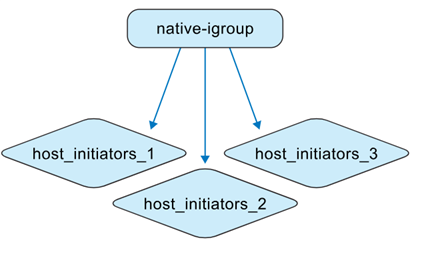
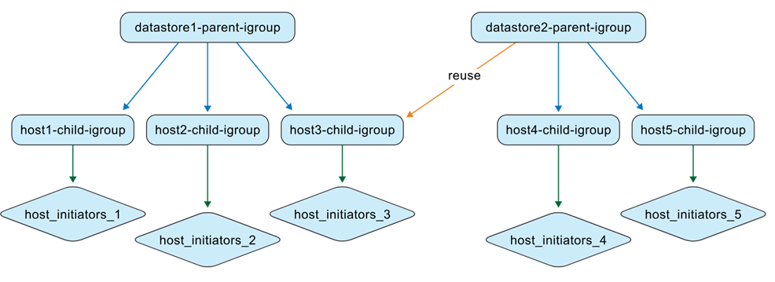
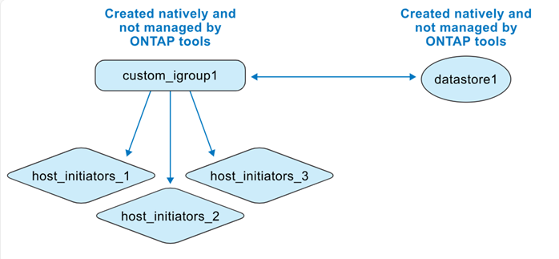

= Entenda os igroups gerenciados pelas ferramentas ONTAP
:allow-uri-read: 
:icons: font
:imagesdir: ../media/

[role="lead"]
Ao gerenciar VMs de ferramentas ONTAP e sistemas de armazenamento ONTAP , entender o comportamento do igroup é essencial, especialmente ao migrar armazenamentos de dados de ambientes não ONTAP para o gerenciamento de ferramentas ONTAP . Esta seção descreve como os igroups são atualizados durante essa transição.

As ONTAP tools for VMware vSphere 10.4 simplificam o gerenciamento de armazenamento de dados automatizando a criação e a manutenção de objetos ONTAP e vCenter em ambientes de datacenter VMware.

As ONTAP tools for VMware vSphere 10.4 interpretam igroups em dois contextos diferentes:

.Ferramentas não ONTAP gerenciam igroups
Como administrador de armazenamento, você pode criar igroups no sistema ONTAP como estruturas simples ou aninhadas. A ilustração mostra um igroup plano criado no sistema ONTAP .

.Ferramentas ONTAP gerenciam igroups
Ao criar armazenamentos de dados, as ONTAP tools for VMware vSphere 10.4 criam automaticamente igroups usando uma estrutura aninhada para facilitar o mapeamento de LUN.

Por exemplo, quando o datastore1 é criado e montado nos hosts 1, 2 e 3, e um novo datastore (datastore2) é criado e montado nos hosts 3, 4 e 5, as ferramentas ONTAP reutilizam o igroup de nível de host para gerenciamento eficiente.

image:../media/otv-managed.png["Ferramentas ONTAP gerenciadas igroup"]

Aqui estão alguns casos de ONTAP tools for VMware vSphere .

*Quando você cria um armazenamento de dados com configurações igroup padrão*

Quando você cria um armazenamento de dados e deixa o campo igroup em branco (configuração padrão), as ferramentas ONTAP geram automaticamente uma estrutura de igroup aninhada para esse armazenamento de dados. O igroup pai no nível do armazenamento de dados é nomeado usando o padrão: otv_<vcguid>_<host_parent_datacenterMoref>_<datastore_name>. Cada igroup filho no nível de host segue o padrão: otv_<hostMoref>_<vcguid>. Você pode visualizar a associação entre os igroups pai (nível de armazenamento de dados) e filho (nível de host) na seção *Grupo Iniciador Pai* da interface de armazenamento do ONTAP .

Com a abordagem de igroup aninhado, os LUNs são mapeados apenas para os igroups filhos. O inventário do vCenter Server exibe o novo armazenamento de dados.

*Quando você cria um armazenamento de dados com um nome de igroup personalizado*

Durante a criação do armazenamento de dados nas ferramentas ONTAP , você pode inserir um nome de igroup personalizado em vez de selecionar no menu suspenso. As ferramentas ONTAP então criam um igroup pai no nível do armazenamento de dados usando o nome especificado. Se o mesmo host for usado para vários armazenamentos de dados, o igroup (filho) de nível de host existente será reutilizado. Como resultado, o LUN para o novo armazenamento de dados é mapeado para esse igroup filho existente, que agora pode ser associado a vários igroups pais (um para cada armazenamento de dados). A lista de armazenamento de dados da interface do usuário do vCenter Server confirma a criação bem-sucedida do novo armazenamento de dados com o nome do igroup personalizado.

*Quando você reutiliza o nome do igroup durante a criação do armazenamento de dados*

Ao criar um armazenamento de dados usando a interface de usuário das ferramentas ONTAP , você pode escolher um igroup pai personalizado existente na lista suspensa. Após reutilizar o igroup pai para criar outro armazenamento de dados, a interface do usuário dos sistemas ONTAP mostra esta associação. O novo armazenamento de dados também aparece na interface do usuário do vCenter Server.

Esta operação também pode ser realizada usando a API. Para reutilizar um igroup existente durante a criação do armazenamento de dados, especifique o UUID do igroup no payload da solicitação da API.

*Quando você cria um datastore e um igroup nativamente do ONTAP e do vCenter*

Se você criar o igroup e o datastore diretamente em sistemas ONTAP e ambientes VMware, as ferramentas ONTAP não gerenciarão esses objetos inicialmente. Isso cria uma estrutura de igroup plana.

Para gerenciar um armazenamento de dados e um igroup existentes com ferramentas ONTAP , você deve executar uma descoberta de armazenamento de dados. As ferramentas ONTAP identificam e registram o armazenamento de dados e o igroup e os convertem em uma estrutura aninhada em seu banco de dados. Um novo igroup pai é criado usando o nome personalizado, enquanto o igroup existente é renomeado com o prefixo "otv_" e se torna o igroup filho. Os mapeamentos do iniciador permanecem inalterados. Somente igroups mapeados para armazenamentos de dados são convertidos durante a descoberta. Depois disso, a estrutura do igroup fica como na ilustração abaixo.

image:../media/otv-ds.png["Datastore e igroup gerenciados por ferramentas ONTAP"]

Você pode criar um armazenamento de dados diretamente no vCenter Server e depois colocá-lo sob o gerenciamento de ferramentas ONTAP . Primeiro, crie um igroup simples em sistemas ONTAP e mapeie um LUN para ele. Após executar a descoberta do armazenamento de dados nas ferramentas ONTAP , o igroup plano é convertido em uma estrutura aninhada. As ferramentas ONTAP então gerenciam o igroup, renomeando-o com o prefixo 'otv_'. O LUN permanece mapeado para o mesmo igroup durante todo esse processo.

*Como as ferramentas ONTAP reutilizam igroups criados nativamente*

Você pode provisionar um armazenamento de dados em ferramentas ONTAP usando um igroup criado originalmente em sistemas ONTAP , depois que ele for gerenciado por ferramentas ONTAP . Esses igroups aparecem na lista suspensa de nomes de grupos iniciadores personalizados. O novo LUN para o armazenamento de dados é então mapeado para o igroup filho normalizado correspondente, como "otv_NativeIgroup1".

As ONTAP tools for VMware vSphere não detectam nem usam igroups criados no sistema ONTAP que não são gerenciados pelas ferramentas ONTAP ou vinculados a um armazenamento de dados.
